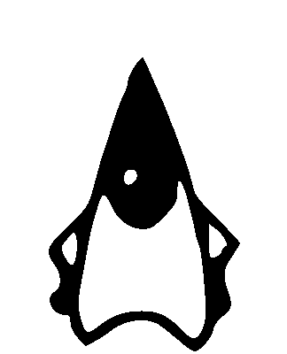

# Waving Duke

This project creates an animated GIF of Duke, the Java mascot, waving. The animation is created from a sequence of images in an old copy of *The Java Tutorial.* The output GIF file consists of binary images so that they can be shown in quick succession on an e-paper display using the animation (A2) *waveform* mode, which works only in pure black and white.

## Background

The animation is created from the sequence of 10 images on the page [Displaying a Sequence of Images](https://courses.cs.washington.edu/courses/cse341/99wi/java/tutorial/ui/drawing/imageSequence.html) in the 1997 version of *The Java Tutorial.* The page is in the Table of Contents under the nested headings: Creating a User Interface, Working with Graphics, Performing Animation, Displaying a Sequence of Images. The [old *Java Tutorial*](https://courses.cs.washington.edu/courses/cse341/99wi/java/tutorial/ "The Java Tutorial (1997-07-08)") can be found on several websites including the previous link to the winter 1999 session of *CSE 341: Programming Languages* at the University of Washington.

## Licenses

The content of this project itself is licensed under the [GNU General Public License v3.0](https://choosealicense.com/licenses/gpl-3.0/) except for the sequence of source images and the output animated GIF, which are published under the following license from Sun Microsystems, Inc., now Oracle Corporation.

> Copyright (c) 1995-1997 Sun Microsystems, Inc. All Rights Reserved.
>
> Permission to use, copy, modify, and distribute this software and its documentation for NON-COMMERCIAL purposes and without fee is hereby granted provided that this copyright notice appears in all copies. Please refer to the file "copyright.html" for further important copyright and licensing information.
>
> SUN MAKES NO REPRESENTATIONS OR WARRANTIES ABOUT THE SUITABILITY OF THE SOFTWARE, EITHER EXPRESS OR IMPLIED, INCLUDING BUT NOT LIMITED TO THE IMPLIED WARRANTIES OF MERCHANTABILITY, FITNESS FOR A PARTICULAR PURPOSE, OR NON-INFRINGEMENT. SUN SHALL NOT BE LIABLE FOR ANY DAMAGES SUFFERED BY LICENSEE AS A RESULT OF USING, MODIFYING OR DISTRIBUTING THIS SOFTWARE OR ITS DERIVATIVES.

This copyright notice accompanies the source code of the program in *The Java Tutorial* that displays the images, which should permit my use of them here. Although [Duke was *open sourced*](https://www.oracle.com/java/duke.html "Duke, the Java Mascot") under a BSD license in 2006, I have been unable to confirm that the specific sequence of source images used by this project were included.

## Building

The [Makefile](Makefile) requires the following programs on your PATH environment variable.

* **convert** – converts between image formats and edits images
* **mkbitmap** – transforms images into bitmaps with scaling and filtering
* **potrace** – transforms bitmaps into vector graphics
* **inkscape** – an SVG editing program

To build *duke-waving.gif*, run the `make` command in the directory that contains the Makefile.

## Images

The sequence of source images (55 × 68 px):

         

The output animated GIF in pure black and white (324 × 400 px):

